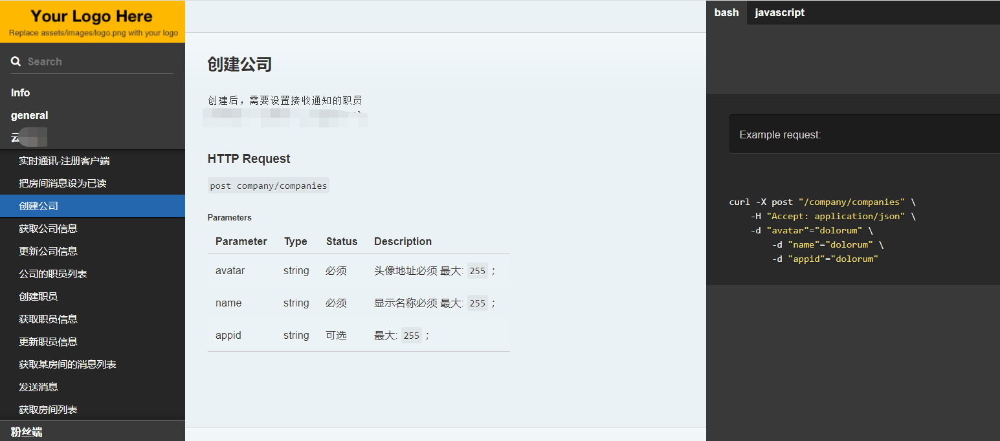

# ThinkPHP api文档自动生成
## 支持  
   thinkphp5.1.*
## 自动生成的效果
    
   
## 安装
1. 安装依赖
    ```bash
    composer require yunbuye/thinkphp-apidoc-generator --dev
    ```
1. 添加命令     
    打开配置文件 application/command.php 添加如下内容
    ```php
    return [
        //...其他命令
        "api-doc:generate"=>Yunbuye\ThinkApiDoc\Commands\GenerateDocumentation::class
    ];
    ```
   
## 使用 
1. 复制语言文件   
    将 vendor/yunbuye/thinkphp-apidoc-generator/resources/lang/zh-cn.php 文件复制到 application/lang/zh-cn.php 。   
    不复制的话，将会没有对应的描述。  
1. 运行命令 生成文档
   ```bash
    php think api-doc:generate --routePrefix=*
   ```
1.  其他参数   
    运行下面命令查看
    ```bash
        php think api-doc:generate -h
    ```
    
## 功能
1. 分组
    * 在控制器头部,其他注释之后添加注释 @resource  拥有下面注释的控制器的操作都会会分到 例子 的这个组里
    ```php
    /**
    * 其他注释后，空行
    *
    * @resource 例子分组，分组名称后必须空行
    *
    */
   class MessagesController
    ```
1. 控制器操作
    操作的文档生成说明
    ```php
   /**
    * 控制器标题，标题后必须有一个空行
    *
    * 其他描述备注，必须与标题隔开一行
    * 
   */
   ```
   例子
   ```php
    /**
     * 某接口名称
     *
     * 文本描述，或者其他描述，比如json
     * {
     *      company_id: '必传',
     *      sale_desc: '按销量降序',
     *      price_desc: '按价格降序',
     *      price_asc: '按价格升序'
     *  }
     * @param string $name
     * @return string
     */
   ```
1. 请求参数自动生成   
   在控制器操作里，依赖注入请求验证，会自动生成参数文档。  
   但是表单验证类，必须继承 Yunbuye\ThinkApiDoc\FormValidate  而且必须在控制器方法内注入。   
   例：（其中 app\common\validate\Save  继承了 Yunbuye\ThinkApiDoc\FormValidate）
   ```
        /**
       * 创建公司
       *
       * 创建后，需要设置接收通知的职员
       */
     public function save(app\common\validate\Save $validate)
        {
     
       }
   ```
   这样生成文档时，即可自动根据表单验证生成参数说明
 
1. 自定义错误信息（描述）  
   生成文档时，如果对应规则有自定义错误信息，将会被使用。
 
## Thanks
   https://github.com/mpociot/laravel-apidoc-generator
    
## License
   MIT license.